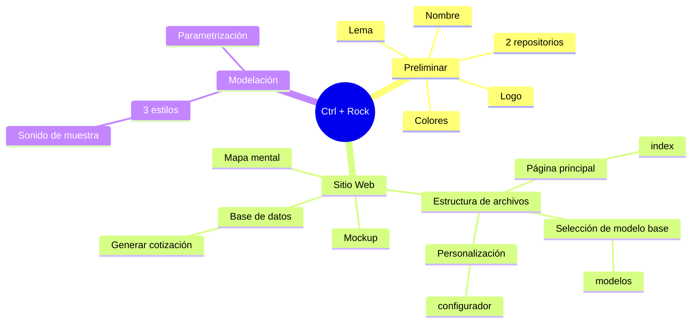

# Ctrl + Rock
> **Controla el diseño, desata el ruido**

- [Ctrl + Rock](#ctrl--rock)
  - [Mapa mental](#mapa-mental)
    - [Propuestas](#propuestas)
  - [Estructura de sitio web](#estructura-de-sitio-web)
  - [Página principal](#página-principal)
  - [Seleccionar modelo](#seleccionar-modelo)
  - [Configurador](#configurador)


## Mapa mental



### Propuestas

- [X] Agregar sonido a página web. Tipo prueba de sonido de la guitarra diseñada
- [ ] Extracción de información para precios de componentes

## Estructura de sitio web

```
└── 📁ctrl-rock
    └── 📁assets
        └── 📁sounds
            ├── Les Paul HH.m4a
            ├── Strat HSS.m4a
            ├── Strat SSS.m4a
            ├── Xiphos HH.m4a
        ├── favicon.ico
        ├── LogoCTRL+ROCK.png
    └── 📁Frontend
        ├── configurador.html
        ├── configurador.js
        ├── index.html
        ├── modelos.html
        ├── modelos.js
        ├── style.css
    └── README.md
```

## Página principal
> `index.html`

Primera página - bienvenida a los usuarios.

## Seleccionar modelo
> `modelos.html`

Muestra de opciones para base de los modelados de guitarra.

## Configurador
> `configurador.html`

Pagina para personalizar el modelado de la guitarra