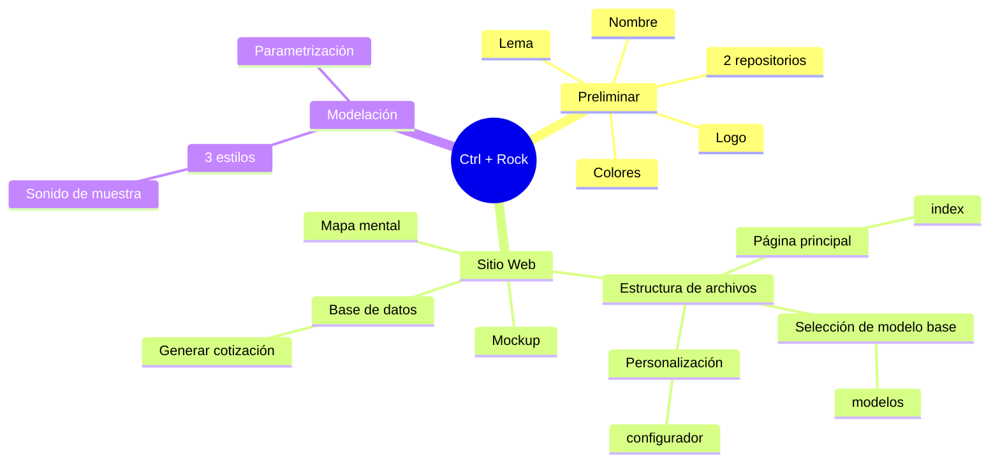
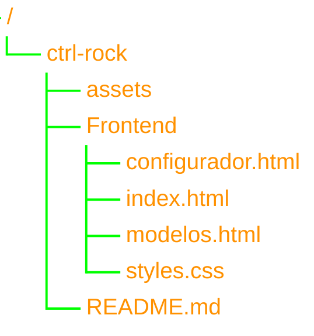

# Ctrl + Rock

- [Ctrl + Rock](#ctrl--rock)
  - [Mapa mental](#mapa-mental)
    - [Propuestas](#propuestas)
  - [Estructura de sitio web](#estructura-de-sitio-web)

## Mapa mental

### Propuestas

- [ ] Agregar sonido a página web. Tipo prueba de sonido de la guitarra diseñada
- [ ] Extracción de información para precios de componentes

## Estructura de sitio web

