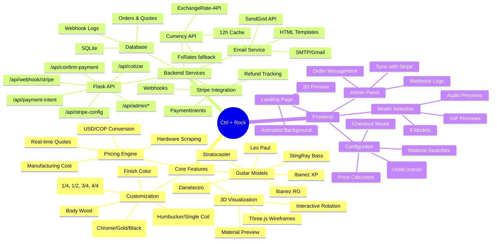
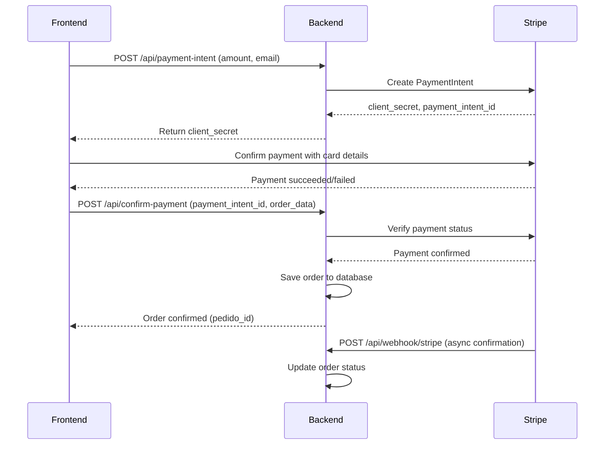

# 🎸 Ctrl + Rock

> **Controla el diseño, desata el ruido**  
> *Control the design, unleash the noise*

---

## 📋 About / Acerca del Proyecto

**Ctrl + Rock** es una plataforma web de personalización de guitarras eléctricas en 3D que permite a los usuarios diseñar, configurar y cotizar su guitarra ideal. La aplicación integra modelado 3D interactivo, cálculo de precios en tiempo real, pasarela de pagos con Stripe y generación de cotizaciones profesionales.

**Ctrl + Rock** is a 3D electric guitar customization web platform that allows users to design, configure, and quote their ideal guitar. The application integrates interactive 3D modeling, real-time pricing calculation, Stripe payment gateway, and professional quote generation.

### 🌟 Key Features / Características Principales

- **3D Guitar Visualization** - Interactive 3D wireframe preview with Three.js
- **Multiple Guitar Models** - 6 iconic guitar models (Les Paul, Stratocaster, Ibanez XP, StingRay, Ibanez RG, Danelectro)
- **Real-time Pricing** - Dynamic price calculation with USD/COP conversion
- **Stripe Integration** - Secure payment processing with webhooks
- **Audio Previews** - Listen to guitar tones before purchasing
- **Admin Dashboard** - Order management and webhook monitoring
- **Email Notifications** - Automated confirmation emails (SMTP/SendGrid)
- **CAD Export Ready** - Parameter export for Autodesk Inventor and other CAD software

---

## 🏗️ Project Structure / Estructura del Proyecto

```
ctrl-rock-main/
├── 📁 Backend/                          # Python Flask API
│   ├── app.py                           # Main server & API routes
│   ├── db.py                            # SQLite database operations
│   ├── stripe_payments.py               # Stripe payment integration
│   ├── exchange_rates.py                # USD/COP currency conversion
│   ├── email_sender.py                  # Email service (SendGrid)
│   ├── email_service.py                 # Email service (SMTP)
│   ├── zenrows_scraper.py               # Amazon price scraping
│   ├── requirements.txt                 # Python dependencies
│   ├── precios_actuales.json            # Current hardware prices
│   └── ctrl_rock.db                     # SQLite database (auto-generated)
│
├── 📁 Frontend/                         # HTML/CSS/JavaScript client
│   ├── index.html                       # Landing page with 3D preview
│   ├── modelos.html                     # Guitar model selection
│   ├── configurador.html                # Guitar customization & checkout
│   ├── admin.html                       # Admin dashboard
│   ├── style.css                        # Global styles
│   ├── configurador.js                  # Configuration logic
│   ├── configurador-logic.js            # CAD parameter logic
│   ├── modelos.js                       # Model selection interactions
│   ├── calculador-precios.js            # Price calculation
│   ├── generador-pdf.js                 # PDF generation
│   └── admin.js                         # Admin panel logic
│
└── 📁 assets/                           # Static resources
    ├── favicon.ico
    ├── LogoCTRL+ROCK.png
    ├── 📁 images/                       # Guitar model images
    ├── 📁 gifs/                         # 3D model animations
    ├── 📁 sounds/                       # Guitar tone samples
    └── 📁 modelos_3d/                   # 3D model files
```

---

## 🧠 Mapa Mental / Mind Map



### 📌 Proposals Completed / Propuestas Cumplidas

- ✅ **[Agregar sonido a página web]** - Tone preview for each guitar model
- ✅ **[Extracción de información para precios de componentes]** - ZenRows Amazon scraper integration

---

## 🚀 Getting Started / Inicio Rápido

### Prerequisites / Prerrequisitos

- **Python 3.9+** 
- **Node.js 16+** (optional, for frontend build tools)
- **Git**

### 1. Clone the Repository / Clonar el Repositorio

```bash
git clone https://github.com/Computacion-Grafica-2026-1/ctrl-rock.git
cd ctrl-rock-main
```

### 2. Backend Setup / Configuración del Backend

```bash
# Navigate to backend directory
cd Backend

# Create virtual environment (recommended)
python -m venv venv

# Activate virtual environment
# Windows:
venv\Scripts\activate
# Mac/Linux:
source venv/bin/activate

# Install dependencies
pip install -r requirements.txt

# Create .env file with required credentials
cp .env.example .env  # If example exists, otherwise create manually
```

### 3. Environment Variables / Variables de Entorno

Create a `.env` file in the `Backend/` directory:

```env
# ==========================================
# STRIPE CONFIGURATION
# ==========================================
STRIPE_SECRET_KEY=sk_test_your_secret_key
STRIPE_PUBLISHABLE_KEY=pk_test_your_publishable_key
STRIPE_WEBHOOK_SECRET=whsec_your_webhook_secret

# ==========================================
# DATABASE
# ==========================================
# SQLite is used by default (no configuration needed)

# ==========================================
# EMAIL SERVICE (Choose one)
# ==========================================
# Option 1: SMTP (Gmail, Outlook, etc.)
SMTP_HOST=smtp.gmail.com
SMTP_PORT=587
SMTP_USER=your-email@gmail.com
SMTP_PASS=your-app-password
FROM_EMAIL=your-email@gmail.com

# Option 2: SendGrid API
SENDGRID_API_KEY=SG.your_sendgrid_api_key

# Option 3: Dry run (no emails sent)
EMAIL_DRY_RUN=true

# ==========================================
# CURRENCY CONVERSION
# ==========================================
EXCHANGE_API_KEY=your_exchangerate_api_key
FXRATES_API_KEY=your_fxrates_api_key

# ==========================================
# ADMIN DASHBOARD
# ==========================================
ADMIN_TOKEN=your_secure_admin_token
```

#### 🔑 How to Get Stripe Keys / Cómo Obtener Claves de Stripe

1. **Create a Stripe Account**: Go to [stripe.com](https://stripe.com) and sign up
2. **Get Test Keys**: 
   - Navigate to Developers → API Keys
   - Copy **Publishable Key** (pk_test_...) and **Secret Key** (sk_test_...)
3. **Configure Webhook**:
   - Go to Developers → Webhooks
   - Add endpoint: `https://your-domain.com/api/webhook/stripe`
   - Select events: `payment_intent.succeeded`, `payment_intent.payment_failed`
   - Copy **Webhook Secret** (whsec_...)

**⚠️ Test Mode**: Use test keys (`pk_test_...`, `sk_test_...`) for development. Switch to live keys for production.

### 4. Run the Backend Server / Ejecutar el Servidor Backend

```bash
# Make sure you're in the Backend directory
python app.py
```

The server will start at: **http://localhost:5000**

#### Available API Endpoints / Endpoints Disponibles

| Endpoint | Method | Description |
|----------|--------|-------------|
| `/api/cotizar` | POST | Generate price quote |
| `/api/stripe-config` | GET | Get Stripe publishable key |
| `/api/payment-intent` | POST | Create payment intent |
| `/api/confirm-payment` | POST | Verify payment and save order |
| `/api/webhook/stripe` | POST | Stripe webhook handler |
| `/api/admin/pedidos` | GET | Admin: list orders |
| `/api/admin/webhook-logs` | GET | Admin: webhook logs |
| `/api/admin/sincronizar-pedido/<id>` | GET | Admin: sync order with Stripe |

### 5. Access the Application / Acceder a la Aplicación

- **Frontend**: http://localhost:5000
- **Admin Panel**: http://localhost:5000/admin.html?token=your_admin_token

---

## 💳 Stripe Integration Guide / Guía de Integración con Stripe

### Step 1: Install Stripe Python SDK

```bash
pip install stripe
```

### Step 2: Configure Stripe Keys

Add these to your `.env` file:

```env
STRIPE_SECRET_KEY=sk_test_51ABC...
STRIPE_PUBLISHABLE_KEY=pk_test_51ABC...
STRIPE_WEBHOOK_SECRET=whsec_...
```

### Step 3: Payment Flow / Flujo de Pago

The application uses Stripe **PaymentIntents** API:



### Step 4: Test Payments / Pagos de Prueba

Use Stripe test card numbers:

```
Card Number: 4242 4242 4242 4242
Expiry: 12/34
CVC: 123
Zip: 12345
```

### Step 5: Monitor Transactions

- **Stpe Dashboard**: View all transactions, refunds, and disputes
- **Admin Panel**: View orders and webhook logs at `/admin.html`
- **Database**: Check `ctrl_rock.db` for local records

---

## 🗄️ Database Schema / Esquema de Base de Datos

### Tables / Tablas

#### `cotizaciones` (Quotes)
```sql
- id (PK)
- nombre, email
- modelo, madera, color, hardware, pickups, dimensiones_cad
- precio_usd, precio_cop, tasa_cambio
- fecha_creacion, estado
```

#### `pedidos` (Orders)
```sql
- id (PK)
- cotizacion_id (FK)
- nombre, email, telefono, direccion, ciudad
- precio_cop, metodo_pago
- stripe_payment_intent_id (UNIQUE)
- fecha_creacion, estado
```

#### `detalles_pedido` (Order Details)
```sql
- id (PK)
- pedido_id (FK)
- componente, nombre
- precio_usd, precio_cop, enlace, cantidad
```

#### `webhook_logs` (Webhook Logs)
```sql
- id (PK)
- evento, payment_intent_id
- datos
- recibido_en
```

---

## 🎨 Frontend Features / Características del Frontend

### Pages / Páginas

1. **Landing Page** (`index.html`)
   - Interactive 3D guitar wireframe
   - Animated background
   - Call-to-action button

2. **Model Selection** (`modelos.html`)
   - 6 guitar models with descriptions
   - Audio preview for each model
   - GIF animations
   - Model history and characteristics

3. **Configurator** (`configurador.html`)
   - Three.js 3D viewer with OrbitControls
   - Material selection (wood, color, hardware, pickups)
   - Real-time price calculation
   - Stripe checkout integration
   - Quote modal with final price

4. **Admin Panel** (`admin.html`)
   - Order management
   - Webhook logs viewer
   - Stripe sync functionality
   - Order status tracking

### Technologies / Tecnologías

- **Three.js r128** - 3D rendering and visualization
- **Stripe.js v3** - Payment processing
- **Vanilla JavaScript** - No frameworks, pure ES6+
- **CSS3** - Modern layout with Grid and Flexbox

---

## 🔧 Configuration / Configuración

### CORS Configuration

The backend uses Flask-CORS. To modify allowed origins, edit `app.py`:

```python
CORS(app, resources={r"/api/*": {"origins": "http://localhost:5000"}})
```

### Price Scraper Configuration

The `zenrows_scraper.py` module scrapes Amazon for hardware prices. Configure ZenRows API key:

```env
ZENROWS_API_KEY=your_zenrows_api_key
```

### Email Configuration

Choose one email service:

**SMTP (Gmail example)**:
```env
SMTP_HOST=smtp.gmail.com
SMTP_PORT=587
SMTP_USER=your-email@gmail.com
SMTP_PASS=your-app-password  # Use App Password, not regular password
```

**SendGrid**:
```env
SENDGRID_API_KEY=SG.your_api_key
FROM_EMAIL=noreply@ctrlrock.com
```

---

## 🧪 Testing / Pruebas

### Run Backend Tests

```bash
# Test Stripe integration
python Backend/stripe_payments.py

# Test database
python Backend/db.py

# Test currency conversion
python Backend/exchange_rates.py

# Test email service
python Backend/email_service.py
```

### Frontend Testing

1. Open http://localhost:5000
2. Select a guitar model
3. Customize components
4. Click "Cotizar mi guitarra"
5. Use Stripe test card: `4242 4242 4242 4242`

---

## 📦 Dependencies / Dependencias

### Backend (Python)

```
flask>=3.0.0          # Web framework
flask-cors>=4.0.0     # CORS support
stripe>=7.0.0         # Payment processing
requests>=2.31.0      # HTTP requests
beautifulsoup4>=4.12.0 # Web scraping
python-dotenv>=1.0.0  # Environment variables
supabase>=2.0.0       # Database client (optional)
sendgrid>=6.10.0      # Email service
cachetools>=5.3.0     # Caching utilities
```

### Frontend (CDN)

- Three.js r128
- Stripe.js v3
- OrbitControls

---

## 🚢 Deployment / Despliegue

### Production Checklist / Lista de Verificación

- [ ] Switch Stripe keys to live mode (`sk_live_...`, `pk_live_...`)
- [ ] Configure production database (PostgreSQL recommended)
- [ ] Set up Stripe webhook endpoint with HTTPS
- [ ] Configure email service with domain authentication
- [ ] Set `EMAIL_DRY_RUN=false`
- [ ] Enable Flask debug mode: `debug=False`
- [ ] Use production WSGI server (Gunicorn, uWSGI)
- [ ] Configure environment variables on hosting platform
- [ ] Set up SSL/TLS certificate
- [ ] Configure CORS for production domain

### Recommended Hosting / Hosting Recomendado

- **Backend**: Heroku, Railway, Render, AWS EC2
- **Frontend**: Netlify, Vercel, Cloudflare Pages
- **Database**: Supabase, AWS RDS, Neon (PostgreSQL)

---

## 🤝 Contributing / Contribución

1. Fork the repository
2. Create a feature branch (`git checkout -b feature/nueva-funcionalidad`)
3. Commit your changes (`git commit -am 'Add: nueva funcionalidad'`)
4. Push to the branch (`git push origin feature/nueva-funcionalidad`)
5. Open a Pull Request

---

## 📄 License / Licencia

This project is proprietary and confidential.  
Este proyecto es propietario y confidencial.

---

## 📞 Contact / Contacto

- **Email**: contacto@ctrlrock.com
- **Support**: soporte@ctrlrock.com
- **Phone**: +57 315 2200001
- **Hours**: Lun - Vie: 9:00 am - 6:00 pm | Sáb: 10:00 am - 2:00 pm

---

## 🗺️ Roadmap / Hoja de Ruta

- [ ] Add more guitar models (PRS, Gretsch, etc.)
- [ ] Implement AR preview with mobile cameras
- [ ] Social sharing of custom designs
- [ ] Multi-language support (EN/ES/FR)
- [ ] User accounts and wishlist
- [ ] Integration with CAD software (AutoDesk, SolidWorks)
- [ ] 3D printing export (STL, OBJ)
- [ ] Community design gallery
- [ ] Influencer collaboration program

---

<div align="center">
  <p>Made with 🎸 and ☕ by the Ctrl + Rock Team</p>
  <p>© 2026 Ctrl + Rock. Todos los derechos reservados.</p>
</div>